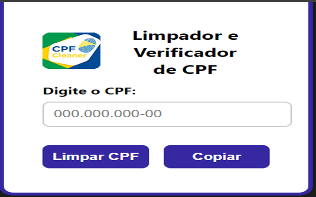

# Extensão Chrome de Retirar Pontuação de CPFs Válidos

* Ferramenta simples para auxiliar em buscas e projetos em que precisa validar e retirar a pontuação cpf

* Disponível em: [CPF Cleaner - Google Chrome Web Store](https://chromewebstore.google.com/detail/cpfcleaner/fhomagbdgkgnfnejbilecnblpidfopld?authuser=0&hl=pt-BR)

### Funcionalidades

* Retira a pontuação

*  Exemplo : 111.444.777-35 
retorna 1114447735

* Inteface Simples Exemplo

